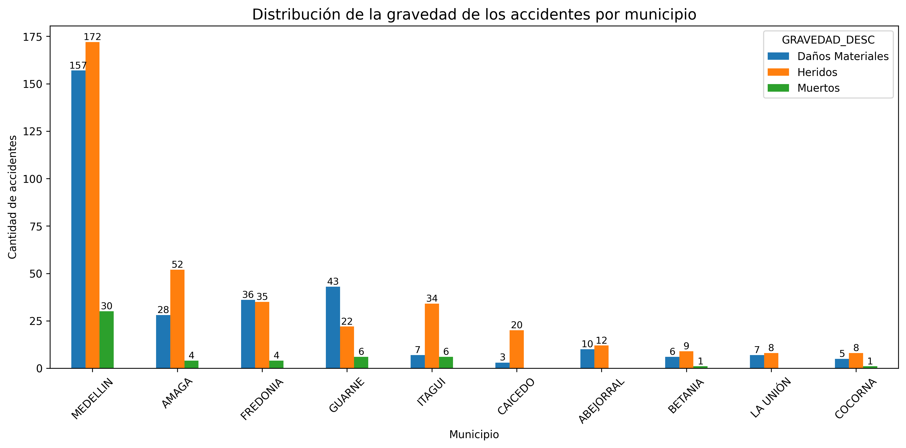
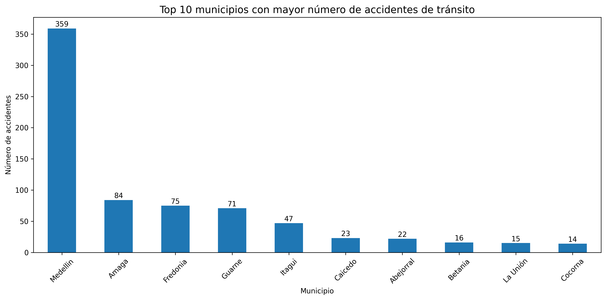

# 🚦 Análisis de Accidentes de Tránsito en Antioquia

## Objetivo

Analizar los accidentes de tránsito reportados en municipios de Antioquia para identificar patrones de accidentalidad, gravedad y mortalidad mediante técnicas de análisis exploratorio de datos (EDA).

## Dataset

Fuente de datos: Gerencia de Seguridad Vial de Antioquia.

## Herramientas utilizadas

* Python
* Pandas
* Matplotlib
* Google Colab
* GitHub

## Preguntas de negocio

* ¿Qué municipios presentan más accidentes?
* ¿Qué municipios presentan mayor gravedad?
* ¿Cuál es la tasa de mortalidad por municipio?
* ¿En qué horarios ocurren más accidentes?
* ¿Qué condiciones climáticas están asociadas a una mayor accidentalidad?

## Estado del proyecto

🚧 En desarrollo

### Análisis completados

* [x] Distribución de gravedad
* [x] Top 10 municipios con más accidentes
* [x] Tasa de mortalidad

### Análisis pendientes

* [ ] Accidentes por hora
* [ ] Accidentes por día de la semana
* [ ] Accidentes por clima
* [ ] Mapa geográfico
* [ ] Dashboard interactivo
* [ ] Conclusiones finales

## Principales hallazgos

* Medellín concentra el mayor número de accidentes reportados.
* Itagüí presenta la tasa de mortalidad más alta entre los municipios analizados.
* Guarne muestra una proporción significativa de accidentes fatales.
* Los accidentes con heridos representan la categoría más frecuente.

## Visualizaciones

### Distribución de gravedad de los accidentes

### Top 10 municipios con más accidentes

### Tasa de mortalidad por municipio

## Habilidades demostradas

* Limpieza y transformación de datos con Pandas
* Análisis Exploratorio de Datos (EDA)
* Visualización de datos con Matplotlib
* Storytelling con datos
* Documentación de proyectos en GitHub
* Análisis de indicadores de seguridad vial
